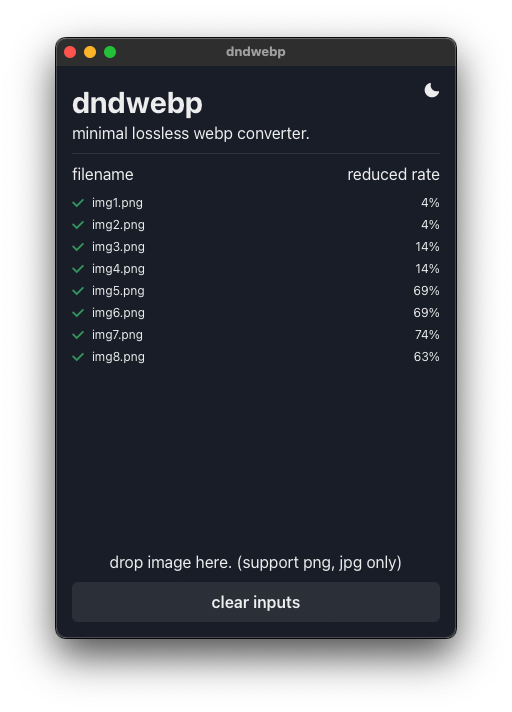

# webptools
minimal webp converter.

## Feature
- convert png/jpg to webp.
- support directory input.
- support drag and drop file input.
- support encode options. (quality, lossless)
- delete original file when complete encode.
- toggle dark/light mode theme.

## Releases
note: code certificate not yet set.
[releases](https://github.com/camiha/webptools/releases)

## Self build
require:
- node.js 22+
- pnpm 9+
- rust (stable)
- tauri development environment (https://v2.tauri.app/start/prerequisites/)

steps:
1. `pnpm install`
2. `pnpm tauri build`
3. create application file in `src-tauri/target/release/bundle/`

for universal binary (macOS):
1. `pnpm install`
2. `pnpm tauri build --target universal-apple-darwin`
